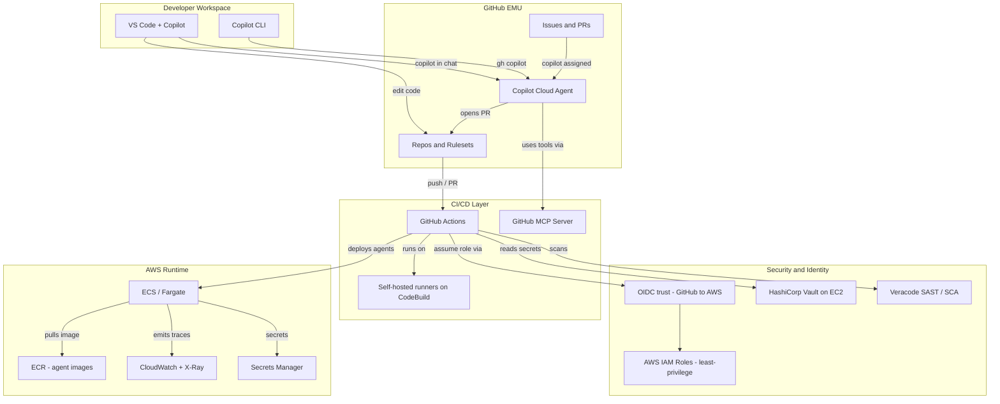
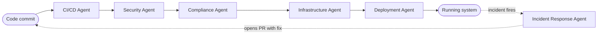
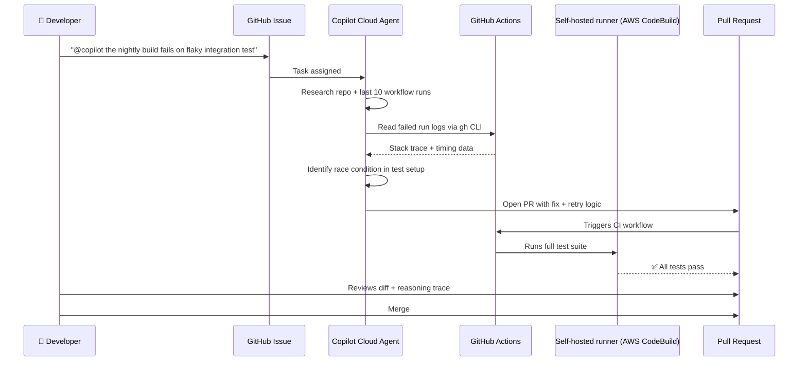
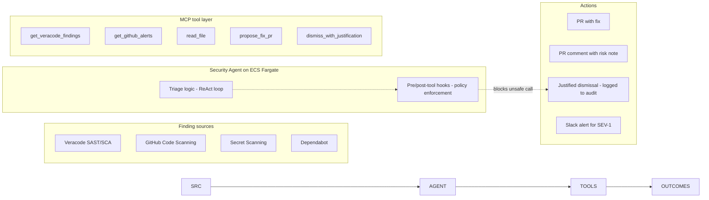
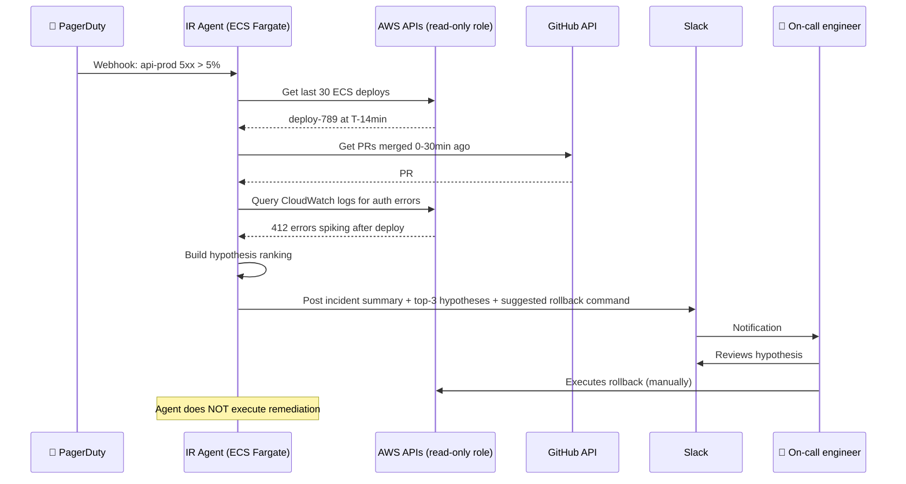
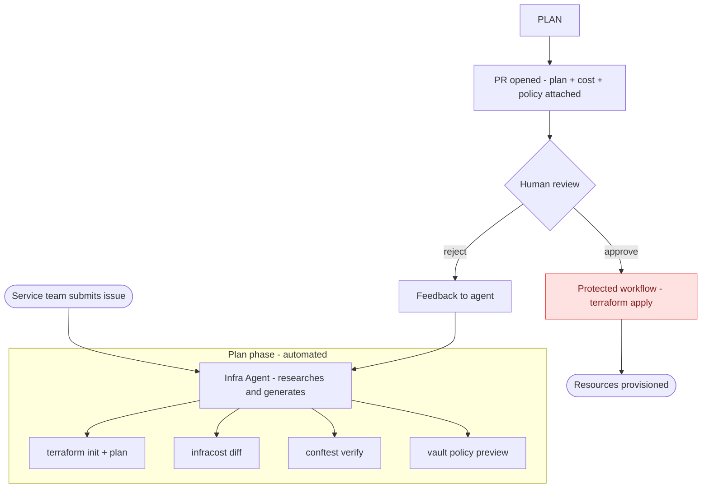
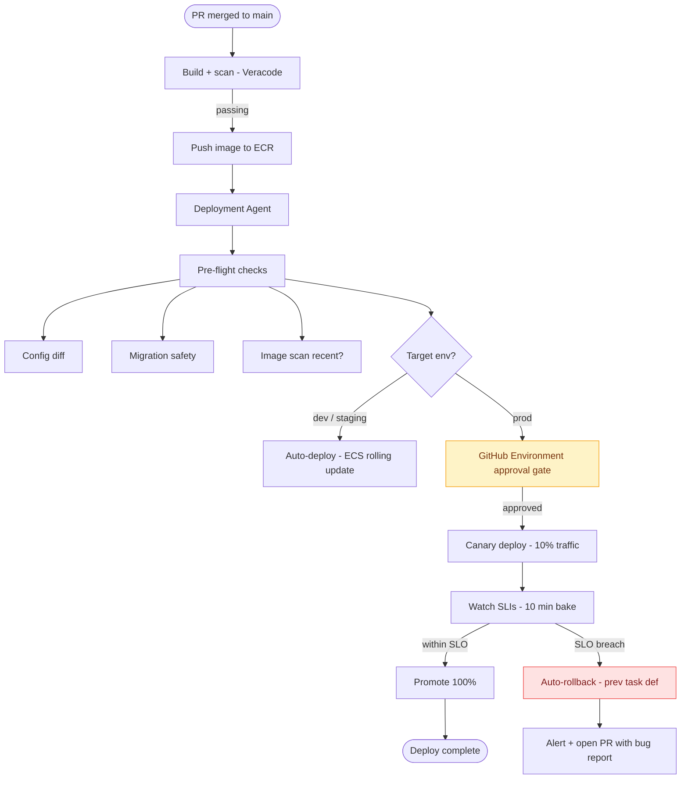
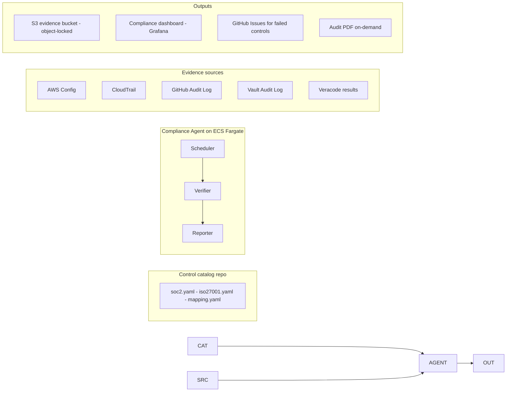
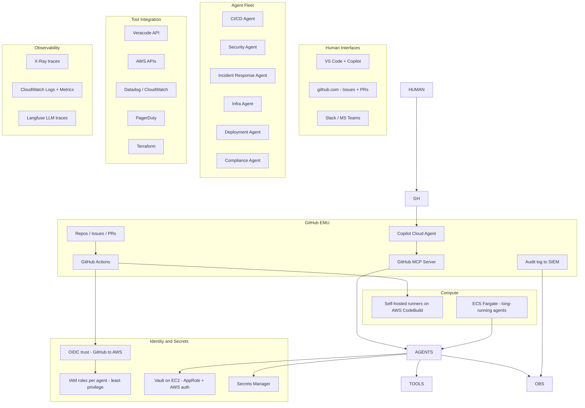
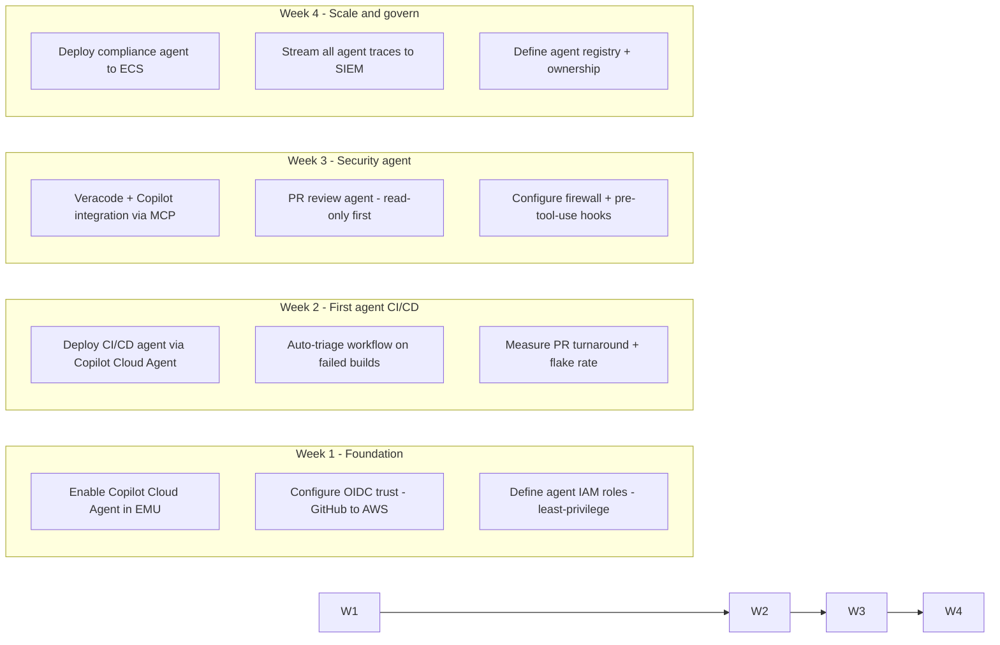

# AI Agents for DevOps and Platform Engineering

> A practical guide for teams running GitHub EMU + GitHub Actions + Veracode + HashiCorp Vault on AWS EC2 + AWS IAM/OIDC + self-hosted runners on AWS CodeBuild + GitHub Copilot.

This guide shows how to design, deploy, and govern six AI agent archetypes — and how each integrates with your existing toolchain using **GitHub Copilot Cloud Agent**, **Copilot in VS Code**, **GitHub Actions**, and **AWS ECS**.

---

## Table of Contents

1. [Your Stack — Agent Integration Map](#your-stack--agent-integration-map)
2. [The Six DevOps Agent Archetypes](#the-six-devops-agent-archetypes)
3. [CI/CD Agents](#1-cicd-agents)
4. [Security Agents](#2-security-agents)
5. [Incident Response Agents](#3-incident-response-agents)
6. [Infrastructure Provisioning Agents](#4-infrastructure-provisioning-agents)
7. [Deployment Agents](#5-deployment-agents)
8. [Compliance Agents](#6-compliance-agents)
9. [Reference Architecture — Multi-Agent DevOps Platform on AWS](#reference-architecture--multi-agent-devops-platform-on-aws)
10. [Governance Cheat Sheet](#governance-cheat-sheet)
11. [Getting Started — 30-Day Adoption Plan](#getting-started--30-day-adoption-plan)

---

## Your Stack — Agent Integration Map

Before diving into archetypes, here is how AI agents plug into your existing tools.



---

## The Six DevOps Agent Archetypes



Each agent has a specific spot in the value stream. They communicate through GitHub Issues, PRs, and webhook events — using infrastructure you already have.

---

## 1. CI/CD Agents

### Responsibilities

- Investigate failing pipelines and propose fixes (flaky tests, dependency conflicts, runner issues)
- Generate and maintain GitHub Actions workflows
- Optimize build times (caching strategy, parallelization, matrix builds)
- Manage release notes and semantic versioning
- Auto-bump dependencies and verify with test runs

### Inputs

| Input | Source |
|---|---|
| Workflow run logs | GitHub Actions API |
| Failed test output | `gh run view` / artifacts |
| Repo structure & history | Git, GitHub MCP server |
| Issue/PR context | GitHub Issues |
| Branch protection rules | GitHub Rulesets API |

### Outputs

- **Pull requests** — workflow patches, dependency bumps, fix commits
- **Comments on failing PRs** — root cause analysis with suggested fixes
- **GitHub Discussions / Issues** — release notes, optimization recommendations

### Required Tools

| Tool | Purpose |
|---|---|
| GitHub MCP Server | Read/write issues, PRs, workflows, run logs |
| `gh` CLI | Direct API access from agent shell |
| Self-hosted runner on AWS CodeBuild | Execute proposed fixes in your environment |
| Veracode API | Read prior scan results to avoid reintroducing fixed vulns |

### Security Considerations & Governance

- **No direct merges.** Agent opens PRs; humans (or rules) approve. Treat `@copilot` like any contributor under your branch protection rules.
- **Bypass actor configuration.** If your rulesets block bots, explicitly add Copilot Cloud Agent as a bypass actor — never disable the rule.
- **OIDC, not long-lived tokens.** When the agent's PR triggers a workflow, the workflow assumes an AWS role via OIDC; the agent itself never sees AWS credentials.
- **Tool allow-list.** Configure your MCP server to expose only the GitHub tools the agent needs. Restrict access to repo-scoped reads by default; widen only per task.
- **Audit log.** Every Copilot Cloud Agent action is recorded in the GitHub audit log under `copilot.*` events. Stream to your SIEM.

### Architecture



### How to Use This Agent

**In VS Code with Copilot (agent mode):**

```
@copilot Investigate why .github/workflows/ci.yml is failing for PR #1234.
Read the last failing run log and propose a minimal fix as a new branch.
```

**In CI/CD via GitHub Actions** — auto-triage failed builds:

```yaml
# .github/workflows/auto-triage-failed-builds.yml
name: Auto-triage failed CI

on:
  workflow_run:
    workflows: ["CI"]
    types: [completed]

permissions:
  contents: read
  issues: write
  pull-requests: write
  id-token: write   # for AWS OIDC

jobs:
  triage:
    if: ${{ github.event.workflow_run.conclusion == 'failure' }}
    runs-on: [self-hosted, codebuild]
    steps:
      - name: Configure AWS via OIDC
        uses: aws-actions/configure-aws-credentials@v4
        with:
          role-to-assume: arn:aws:iam::${{ vars.AWS_ACCOUNT_ID }}:role/github-actions-cicd-agent
          aws-region: us-east-1

      - name: Fetch Vault token
        id: vault
        uses: hashicorp/vault-action@v3
        with:
          url: ${{ vars.VAULT_ADDR }}
          method: aws
          role: cicd-agent
          secrets: |
            secret/data/copilot api_key | COPILOT_API_KEY

      - name: Create triage issue for Copilot
        env:
          GH_TOKEN: ${{ secrets.GITHUB_TOKEN }}
        run: |
          gh issue create \
            --title "[auto-triage] CI failed on ${{ github.event.workflow_run.head_branch }}" \
            --body "$(cat <<EOF
          @copilot the workflow run below failed. Please investigate and open a PR with a fix.

          - Workflow: ${{ github.event.workflow_run.name }}
          - Run URL: ${{ github.event.workflow_run.html_url }}
          - Head SHA: ${{ github.event.workflow_run.head_sha }}

          Constraints:
          - Do NOT modify .github/workflows/ files that touch production deployment
          - Run the test suite locally in your sandbox before opening the PR
          - Cite the exact log line(s) that identify the root cause
          EOF
          )" \
            --label "copilot,auto-triage"
```

---

## 2. Security Agents

### Responsibilities

- Triage Veracode SAST/SCA findings — confirm true positive, suggest fix, open PR
- Triage GitHub Advanced Security alerts (code scanning, secret scanning, Dependabot)
- Review PRs for security anti-patterns (hardcoded secrets, unsafe deserialization, SQLi)
- Monitor for drift between IaC and deployed config that introduces risk
- Generate threat models from architecture changes

### Inputs

| Input | Source |
|---|---|
| Veracode findings | Veracode REST API (Findings API v2) |
| Code Scanning alerts | GitHub Advanced Security API |
| Secret scanning alerts | GitHub API |
| Dependabot alerts | GitHub API |
| PR diff | GitHub MCP / `gh pr diff` |
| Vault audit log | Vault API |

### Outputs

- **PRs that remediate vulnerabilities** with citations to the alert and the CWE
- **Review comments on PRs** flagging risky patterns
- **Dismissals with justification** for false positives (logged for audit)
- **Slack/Teams alerts** for high-severity findings

### Required Tools

| Tool | Purpose |
|---|---|
| Veracode REST API | Fetch findings, attach mitigations |
| GitHub Advanced Security | Read code scanning + secret alerts |
| MCP custom tools | Wrap Veracode SDK as agent-callable tool |
| Vault API | Read secret leases for credential rotation tasks |
| Static analysis (semgrep, gitleaks) | Pre-flight scan before opening PR |

### Security Considerations & Governance

- **The agent is a target.** A security agent has elevated visibility into vulnerabilities. Run it on isolated runners — never on shared GitHub-hosted runners.
- **Read-only by default.** Initial deployment: agent only reads + comments. Earn trust before granting write/PR-creation permissions.
- **No secret exfiltration risk.** Configure the [Copilot Cloud Agent firewall](https://docs.github.com/en/copilot/how-tos/use-copilot-agents/coding-agent/customize-the-agent-firewall) to block all egress except the GitHub API, Veracode API, and your internal MCP server.
- **Pre-tool-use hooks.** Use [Copilot Cloud Agent hooks](https://docs.github.com/en/copilot/concepts/agents/coding-agent/about-hooks) to validate every tool call. Reject any call that would dismiss a critical Veracode finding without a documented justification.
- **Four-eyes for dismissals.** Agent can propose dismissing a false positive but a human security reviewer must approve.

### Architecture



### How to Use This Agent

**In VS Code:**

```
@copilot Review the open Veracode findings for severity ≥ medium on this branch.
For each true positive that you can fix in <50 lines, open a PR with the fix.
For others, post a comment with: CWE, file:line, suggested remediation, and risk score.
```

**In CI/CD — every PR triggers a security review:**

```yaml
# .github/workflows/pr-security-review.yml
name: Security agent PR review

on:
  pull_request:
    types: [opened, synchronize, ready_for_review]

permissions:
  contents: read
  pull-requests: write
  security-events: read
  id-token: write

jobs:
  veracode-scan:
    runs-on: [self-hosted, codebuild]
    steps:
      - uses: actions/checkout@v4

      - name: Configure AWS via OIDC
        uses: aws-actions/configure-aws-credentials@v4
        with:
          role-to-assume: arn:aws:iam::${{ vars.AWS_ACCOUNT_ID }}:role/github-actions-security-agent
          aws-region: us-east-1

      - name: Get Veracode API creds from Vault
        uses: hashicorp/vault-action@v3
        with:
          url: ${{ vars.VAULT_ADDR }}
          method: aws
          role: security-agent
          secrets: |
            secret/data/veracode api_id | VERACODE_API_ID ;
            secret/data/veracode api_key | VERACODE_API_KEY

      - name: Run Veracode pipeline scan
        uses: veracode/Veracode-pipeline-scan-action@v1.0.16
        with:
          vid: ${{ env.VERACODE_API_ID }}
          vkey: ${{ env.VERACODE_API_KEY }}
          file: ./build/libs/app.jar
          fail_build: false

      - name: Assign findings to Copilot for triage
        env:
          GH_TOKEN: ${{ secrets.GITHUB_TOKEN }}
        run: |
          gh pr comment ${{ github.event.pull_request.number }} \
            --body "@copilot Triage the Veracode findings attached as artifact 'pipeline-scan-results.json'.
            For each MEDIUM+ severity, post a review comment with CWE, location, and a fix suggestion."
```

---

## 3. Incident Response Agents

### Responsibilities

- First-responder to alerts (PagerDuty, CloudWatch alarms, Datadog incidents)
- Run safe diagnostic commands (read logs, describe pods, query CloudWatch metrics)
- Correlate the incident with recent deploys, config changes, and infra drift
- Draft incident timeline and root cause hypothesis
- Page humans with summarized context — no autonomous remediation in prod

### Inputs

| Input | Source |
|---|---|
| Alert payload | PagerDuty / CloudWatch / Datadog webhook |
| Recent deploys | GitHub Deployments API |
| Recent merged PRs | GitHub API |
| Runtime logs | CloudWatch Logs Insights |
| Metrics | CloudWatch / Datadog API |
| Infra state | Terraform state, AWS APIs (read-only) |

### Outputs

- **Incident summary** posted to Slack incident channel
- **Timeline document** with correlated events
- **Hypothesis ranking** with confidence and evidence
- **Suggested next actions** — never executed without human approval

### Required Tools

| Tool | Purpose |
|---|---|
| AWS read-only IAM role | Describe resources, read CloudWatch |
| MCP custom tools | `query_cloudwatch_logs`, `get_recent_deploys`, `describe_ecs_service` |
| Slack API | Post incident updates to channel |
| GitHub API | Correlate with merged PRs |

### Security Considerations & Governance

- **Read-only is non-negotiable.** Incident response agents never get write permissions to production. Period.
- **Human-in-the-loop for any action.** The agent's output is *advice* to the on-call engineer, not a runbook executor.
- **Time-boxed runs.** Configure a max execution time (15 minutes) and a max iteration count (20 tool calls). Runaway agents during incidents are a real risk.
- **Sensitive data scrubbing.** Pre-output hooks scan agent responses for PII, customer data, secrets — redact before posting to Slack.
- **Separate identity.** The IR agent has its own AWS IAM role, separate from the deploy agent's role, separate from the security agent's role. Least privilege per agent.

### Architecture



### How to Use This Agent

**In VS Code** (post-incident, for the writeup):

```
@copilot Generate a post-incident review document for incident INC-2024-0421.
Pull the Slack timeline from #incidents, correlate with deploys from GitHub,
and produce a doc with: timeline, root cause, contributing factors, action items.
```

**As a long-running ECS service** — agent listens to a webhook endpoint:

```yaml
# .github/workflows/deploy-ir-agent-to-ecs.yml
name: Deploy IR agent to ECS

on:
  push:
    branches: [main]
    paths: ['agents/incident-response/**']

permissions:
  id-token: write
  contents: read

jobs:
  deploy:
    runs-on: [self-hosted, codebuild]
    steps:
      - uses: actions/checkout@v4

      - name: Configure AWS via OIDC
        uses: aws-actions/configure-aws-credentials@v4
        with:
          role-to-assume: arn:aws:iam::${{ vars.AWS_ACCOUNT_ID }}:role/github-actions-deploy
          aws-region: us-east-1

      - name: Build agent image
        run: |
          docker build -t $ECR_REPO:${{ github.sha }} agents/incident-response
          aws ecr get-login-password | docker login --username AWS --password-stdin $ECR_REPO
          docker push $ECR_REPO:${{ github.sha }}

      - name: Update ECS service
        run: |
          aws ecs update-service \
            --cluster devops-agents \
            --service ir-agent \
            --task-definition ir-agent:${{ github.sha }} \
            --force-new-deployment
```

The ECS task definition pins the agent's IAM role to **read-only** scopes:

```json
{
  "family": "ir-agent",
  "taskRoleArn": "arn:aws:iam::ACCOUNT:role/ir-agent-readonly",
  "executionRoleArn": "arn:aws:iam::ACCOUNT:role/ecs-task-execution",
  "containerDefinitions": [{
    "name": "ir-agent",
    "image": "ACCOUNT.dkr.ecr.us-east-1.amazonaws.com/ir-agent:latest",
    "secrets": [
      { "name": "SLACK_TOKEN", "valueFrom": "arn:aws:secretsmanager:...:secret:slack-token" },
      { "name": "ANTHROPIC_API_KEY", "valueFrom": "arn:aws:secretsmanager:...:secret:claude-key" }
    ],
    "environment": [
      { "name": "MAX_ITERATIONS", "value": "20" },
      { "name": "MAX_RUNTIME_SECONDS", "value": "900" }
    ]
  }]
}
```

---

## 4. Infrastructure Provisioning Agents

### Responsibilities

- Generate Terraform / CDK modules from natural-language requests
- Review IaC PRs for security, cost, and standards compliance
- Detect and reconcile drift between Terraform state and AWS reality
- Manage Vault policies and AppRole roles for new services
- Maintain golden-path module library

### Inputs

| Input | Source |
|---|---|
| Service request | GitHub Issue (templated form) |
| Existing modules | Internal Terraform module registry |
| AWS state | `terraform plan` output |
| Cost estimates | Infracost API |
| Policy as code | OPA / Conftest policies |

### Outputs

- **PRs to infrastructure repos** with new modules, version bumps, drift fixes
- **Plan summaries** posted as PR comments
- **Cost diff comments** showing impact of changes
- **Vault policy updates** for service identities

### Required Tools

| Tool | Purpose |
|---|---|
| Terraform CLI | `init`, `plan`, `validate` only (never `apply`) |
| Infracost | Cost estimation |
| Conftest / OPA | Policy validation |
| Vault CLI | Read existing policies; propose changes |
| AWS read-only role | Describe existing resources |

### Security Considerations & Governance

- **Plan-only, never apply.** The agent generates Terraform code and runs `plan`, but never executes `apply`. A protected GitHub Actions workflow with manual approval handles `apply`.
- **OIDC-only for AWS.** The plan runs under a tightly-scoped read-only OIDC role. Apply requires a separate role gated by environment protection rules.
- **Cost guardrails.** Any plan increasing monthly cost above a threshold (e.g., $500) requires FinOps approval — automated check before merge.
- **Module pinning.** Agent must use only modules from your approved registry; this is enforced by a pre-tool-use hook.
- **Vault policy diff in PR.** Any Vault policy change is shown as a clear diff for human review.

### Architecture



### How to Use This Agent

**In VS Code:**

```
@copilot Create a Terraform module for a new ECS Fargate service called 'orders-api'.
Use our standard module from internal-tf-modules/ecs-service v3.1.
Requirements:
- 2 vCPU, 4GB memory
- ALB target group with health check at /health
- IAM task role with read access to dynamodb table orders-{env}
- Vault AppRole for the service to fetch DB credentials
Run terraform plan and infracost diff before opening the PR.
```

**In CI/CD — drift detection on a schedule:**

```yaml
# .github/workflows/drift-detection.yml
name: Infra drift detection

on:
  schedule:
    - cron: '0 6 * * 1-5'  # weekdays 6 AM UTC
  workflow_dispatch:

permissions:
  id-token: write
  contents: read
  issues: write

jobs:
  detect-drift:
    runs-on: [self-hosted, codebuild]
    strategy:
      matrix:
        environment: [dev, staging, prod]
    steps:
      - uses: actions/checkout@v4

      - name: Configure AWS via OIDC (read-only)
        uses: aws-actions/configure-aws-credentials@v4
        with:
          role-to-assume: arn:aws:iam::${{ vars.AWS_ACCOUNT_ID }}:role/tf-plan-${{ matrix.environment }}
          aws-region: us-east-1

      - name: Terraform plan
        id: plan
        run: |
          cd terraform/${{ matrix.environment }}
          terraform init
          terraform plan -detailed-exitcode -out=tfplan
        continue-on-error: true

      - name: File issue if drift detected
        if: steps.plan.outcome == 'failure'
        env:
          GH_TOKEN: ${{ secrets.GITHUB_TOKEN }}
        run: |
          terraform show -no-color tfplan > plan.txt
          gh issue create \
            --title "[drift] ${{ matrix.environment }} environment has unmanaged changes" \
            --body "@copilot Drift detected in ${{ matrix.environment }}. Plan output attached.
            Investigate the cause, then open a PR that either:
            (a) updates the Terraform code to match reality (if change was intentional), or
            (b) provides a remediation plan to revert (if change was unauthorized).
            Cite the AWS resource ARN(s) in question." \
            --label "drift,infra,${{ matrix.environment }}"
```

---

## 5. Deployment Agents

### Responsibilities

- Orchestrate deployments across environments with environment-specific gates
- Run pre-deployment safety checks (config diff, migration safety, dependency health)
- Execute canary and blue/green deployments to ECS
- Monitor post-deploy SLIs for the bake window
- Trigger rollback if SLO breach is detected

### Inputs

| Input | Source |
|---|---|
| Build artifact | ECR image tag |
| Deploy intent | GitHub Deployment event |
| SLO thresholds | Datadog / CloudWatch SLO config |
| Migration scripts | Repo (with `safe-migration` label) |
| Environment config | AWS SSM Parameter Store |

### Outputs

- **GitHub Deployment status updates** through each phase
- **Pre-flight check report** — config diff, migration analysis, image vulnerability scan results
- **Canary results** — SLI deltas during canary window
- **Rollback execution** with full audit trail

### Required Tools

| Tool | Purpose |
|---|---|
| AWS ECS API | Update service, manage task definitions |
| GitHub Deployments API | Status updates |
| CloudWatch / Datadog API | Read SLI/SLO metrics |
| Veracode | Verify image scan status before deploy |
| Vault | Issue short-lived deploy tokens |

### Security Considerations & Governance

- **Production = mandatory human approval.** GitHub Environments with required reviewers. The agent prepares and proposes; a human clicks "approve."
- **Image attestation.** Only deploy images signed with cosign and with a passing Veracode scan in the last 7 days.
- **Time-window restriction.** Deploys to prod only allowed within defined change windows (configured via OPA policy at the workflow level).
- **Rollback authority is scoped.** The agent can roll back to the previous known-good task definition automatically *only if* SLO breach exceeds defined thresholds and the deploy is in its canary window.
- **Migration safety check.** For any deploy that includes a DB migration, the agent must verify the migration is backward-compatible (using a `safe-migration` annotation and automated checks like `migra` or `pt-online-schema-change` dry-run).

### Architecture



### How to Use This Agent

**In VS Code:**

```
@copilot Prepare a release of orders-api v2.4.0 to staging.
- Compare config between current staging and proposed v2.4.0
- Check if any DB migrations are present and verify they are backward-compatible
- Open the deploy PR with the pre-flight summary
- Do NOT initiate the actual deploy — just prepare it
```

**In CI/CD — canary deploy to prod via GitHub Environments:**

```yaml
# .github/workflows/deploy-prod-canary.yml
name: Deploy to prod (canary)

on:
  workflow_dispatch:
    inputs:
      image_tag:
        required: true
      service:
        required: true

permissions:
  id-token: write
  contents: read
  deployments: write

jobs:
  preflight:
    runs-on: [self-hosted, codebuild]
    outputs:
      can_deploy: ${{ steps.checks.outputs.ok }}
    steps:
      - uses: actions/checkout@v4
      - name: Configure AWS (read-only)
        uses: aws-actions/configure-aws-credentials@v4
        with:
          role-to-assume: arn:aws:iam::${{ vars.AWS_ACCOUNT_ID }}:role/preflight-readonly
          aws-region: us-east-1
      - id: checks
        run: |
          # Verify image has recent passing Veracode scan
          # Verify cosign signature
          # Verify migration safety
          # Verify no incident in progress
          ./scripts/preflight.sh \
            --service ${{ inputs.service }} \
            --image ${{ inputs.image_tag }}
          echo "ok=true" >> $GITHUB_OUTPUT

  canary:
    needs: preflight
    if: needs.preflight.outputs.can_deploy == 'true'
    runs-on: [self-hosted, codebuild]
    environment:
      name: production            # ← Required reviewers configured here
      url: https://api.example.com
    steps:
      - name: Configure AWS via OIDC
        uses: aws-actions/configure-aws-credentials@v4
        with:
          role-to-assume: arn:aws:iam::${{ vars.AWS_ACCOUNT_ID }}:role/ecs-deploy-prod
          aws-region: us-east-1

      - name: Canary 10%
        run: |
          aws ecs update-service \
            --cluster prod \
            --service ${{ inputs.service }} \
            --task-definition ${{ inputs.service }}:${{ inputs.image_tag }} \
            --deployment-configuration "maximumPercent=110,minimumHealthyPercent=90"

      - name: Bake — monitor SLIs for 10 min
        run: ./scripts/watch-slis.sh --service ${{ inputs.service }} --duration 600s

      - name: Promote
        run: ./scripts/promote-canary.sh --service ${{ inputs.service }}
```

---

## 6. Compliance Agents

### Responsibilities

- Continuously verify control evidence (SOC 2, ISO 27001, PCI, HIPAA) against running systems
- Generate evidence packages for audits (logs, configs, screenshots, attestations)
- Detect control drift (e.g., MFA disabled on an IAM user)
- Map findings to specific compliance frameworks and controls
- Maintain control-to-artifact mapping in code

### Inputs

| Input | Source |
|---|---|
| Control catalog | YAML in compliance repo |
| AWS Config rules | AWS Config API |
| GitHub org settings | GitHub Enterprise API |
| Vault audit log | Vault API |
| Veracode policy results | Veracode API |
| Access logs | CloudTrail |

### Outputs

- **Evidence repository updates** — auto-generated attestations with timestamps and links
- **Compliance dashboard** showing control status (green/yellow/red)
- **Issues for control failures** assigned to the responsible team
- **Audit-ready PDF / markdown reports** generated on demand

### Required Tools

| Tool | Purpose |
|---|---|
| AWS Config / Security Hub | Read control state |
| CloudTrail Lake | Query access patterns |
| GitHub Enterprise Audit Log API | Verify access controls |
| Veracode | Verify SAST policy compliance |
| Vault audit log | Track secret access |

### Security Considerations & Governance

- **Read-only across the board.** Compliance agents observe and report, never remediate. Remediation is a separate workflow (often handled by infra or security agents under approval).
- **Tamper-evident evidence.** All evidence artifacts written to an S3 bucket with object lock and versioning. Agent can write-once but not modify.
- **Separation of duties.** The compliance agent's role must not be assumable by deploy/infra agents — auditors require independence.
- **PII redaction at source.** Logs queried for compliance evidence must pass through a PII scrubber before storage.
- **Versioned control catalog.** The control-to-artifact mapping lives in a Git repo with strict review; changes require security + compliance approval.

### Architecture



### How to Use This Agent

**In VS Code:**

```
@copilot Generate the evidence package for SOC 2 CC6.1 (logical access controls)
for the period 2024-01-01 to 2024-03-31. Include:
- All IAM users + their MFA status
- All exceptions and their approvals
- Sample access reviews from the period
Output as a markdown report with links to S3 artifacts.
```

**In CI/CD — continuous compliance checks:**

```yaml
# .github/workflows/compliance-check.yml
name: Continuous compliance verification

on:
  schedule:
    - cron: '0 */4 * * *'  # every 4 hours
  workflow_dispatch:

permissions:
  id-token: write
  contents: read
  issues: write

jobs:
  verify:
    runs-on: [self-hosted, codebuild]
    strategy:
      matrix:
        framework: [soc2, iso27001, pci-dss]
    steps:
      - uses: actions/checkout@v4

      - name: Configure AWS via OIDC (read-only audit role)
        uses: aws-actions/configure-aws-credentials@v4
        with:
          role-to-assume: arn:aws:iam::${{ vars.AWS_ACCOUNT_ID }}:role/compliance-readonly
          aws-region: us-east-1

      - name: Run control verification
        id: verify
        run: |
          ./bin/compliance-agent verify \
            --framework ${{ matrix.framework }} \
            --output-dir ./evidence/${{ matrix.framework }}/$(date +%Y-%m-%d-%H)

      - name: Upload evidence to S3 (object-locked)
        run: |
          aws s3 sync ./evidence/${{ matrix.framework }} \
            s3://compliance-evidence-prod/${{ matrix.framework }}/ \
            --metadata-directive REPLACE \
            --metadata "generated-by=compliance-agent,run-id=${{ github.run_id }}"

      - name: Open issues for control failures
        if: steps.verify.outputs.failed_controls != ''
        env:
          GH_TOKEN: ${{ secrets.GITHUB_TOKEN }}
        run: |
          for control in $(echo "${{ steps.verify.outputs.failed_controls }}" | jq -r '.[]'); do
            gh issue create \
              --title "[compliance/${{ matrix.framework }}] Control failure: $control" \
              --body "@copilot Investigate control failure for $control. Do NOT remediate — produce a root cause analysis and tag the responsible team." \
              --label "compliance,${{ matrix.framework }}" \
              --assignee compliance-team
          done
```

---

## Reference Architecture — Multi-Agent DevOps Platform on AWS

This is how all six agents fit together in production.



---

## Governance Cheat Sheet

| Agent | Write to prod? | Auto-merge PRs? | Needs HITL? | Where it runs |
|---|---|---|---|---|
| CI/CD agent | No | No | Branch protection rules suffice | Copilot Cloud Agent + GHA |
| Security agent | No | No, opens PR only | Yes for dismissals | Copilot Cloud Agent + ECS |
| Incident response | Read-only | N/A | Always — proposes only | ECS Fargate |
| Infrastructure | Plan-only | No, GHA Environment gates apply | Yes for apply | GHA + ECS |
| Deployment | Yes, gated | No | Yes for prod | GHA with Environments |
| Compliance | Read-only | N/A | Findings → human triage | ECS Fargate |

### Universal rules

1. **Every agent has its own AWS IAM role.** No shared roles between agent types.
2. **OIDC over long-lived tokens.** Always. Bind `sub` claim to `repo:org/name:environment:env-name`.
3. **MCP firewall is configured.** Default-deny egress; allow only the specific APIs the agent needs.
4. **Pre-tool-use hooks enforce policy.** Reject destructive calls at the gateway, not by hoping the model behaves.
5. **Cost caps are hard limits.** Per-agent monthly token budget; hard-stop on breach with PagerDuty alert.
6. **All agent traces stream to SIEM.** Reasoning + tool calls + outcomes. Compliance and forensics need this.
7. **Treat agent prompts as code.** Version-controlled, peer-reviewed, eval-tested.

---

## Getting Started — 30-Day Adoption Plan



### Concrete starting tasks

1. **Pick one repo.** Don't roll out to the whole org. A team that owns one service and is enthusiastic.
2. **Start with CI/CD agent.** Lowest risk, fastest visible value. Auto-triage of failed builds.
3. **Read-only first.** Every agent gets read-only AWS permissions for week one. Earn write access through demonstrated reliability.
4. **Instrument from day one.** Stream Copilot Cloud Agent audit events, GitHub Actions logs, and ECS task logs to your SIEM before granting any write permissions.
5. **Define an exit ramp.** Document how to disable each agent (single command), revoke its tokens, and surface this in your runbook.

---

## Further Reading

- [About GitHub Copilot Cloud Agent](https://docs.github.com/en/copilot/concepts/agents/coding-agent/about-coding-agent)
- [Customize the Copilot agent firewall](https://docs.github.com/en/copilot/how-tos/use-copilot-agents/coding-agent/customize-the-agent-firewall)
- [Extending the Copilot agent with MCP](https://docs.github.com/en/copilot/how-tos/use-copilot-agents/coding-agent/extend-coding-agent-with-mcp)
- [Configuring OpenID Connect in AWS](https://docs.github.com/en/actions/security-for-github-actions/security-hardening-your-deployments/configuring-openid-connect-in-amazon-web-services)
- [Veracode pipeline scan action](https://github.com/veracode/Veracode-pipeline-scan-action)
- [HashiCorp vault-action](https://github.com/hashicorp/vault-action)
- [AWS configure-aws-credentials action](https://github.com/aws-actions/configure-aws-credentials)

---

*Generated with Claude — DevOps and Platform Engineering AI agent curriculum.*
